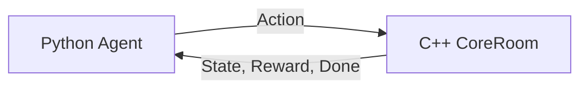

# MDP (Markov Decision Process) Design for Project TOY

이 문서는 C++ 게임 서버 로직(`CoreRoom`)을 파이썬 바인딩(`game_core.pyd`)을 통해 제어하여 강화학습 에이전트(Player/Monster)를 학습시키기 위한 **MDP(Markov Decision Process)** 설계안입니다.

---

## 1. 개요 (Overview)

강화학습 에이전트가 게임 환경 내에서 최적의 정책(Policy)을 학습하도록 환경을 수학적으로 정의합니다. 
시뮬레이터는 네트워크 I/O가 제외된 순수 C++ 게임 로직(`CoreRoom`)이며, 파이썬 상에서 동기식(Synchronous)으로 `Step`과 `Reset`을 수행합니다.

---

## 2. MDP 구성 요소 설계

### 1) 상태 공간 (State Space / Observation, $S$)

에이전트가 매 결정 순간마다 환경으로부터 관측(Observe)하는 데이터의 집합입니다. 연속적인 물리 공간 정보를 다루기 위해 **Box (Continuous)** 공간으로 설계하는 것이 일반적입니다.

| 데이터 항목 | 데이터 타입 | 설명 |
| :--- | :--- | :--- |
| **Agent Position** | `Vector3` (float x, y, z) | 에이전트의 현재 3차원 위치 좌표 |
| **Agent HP Ratio** | `float` (0.0 ~ 1.0) | 에이전트의 현재 체력 비율 ($\frac{HP_{current}}{HP_{max}}$) |
| **Skill Cooltime** | `float` (0.0 ~ 1.0) | 주요 스킬의 재사용 대기시간 잔여 비율 (0 = 사용 가능) |
| **Target Relative Pos** | `Vector3` (float dx, dy, dz) | 가장 가까운 타겟(적)과의 상대적 위치 벡터 ($P_{target} - P_{agent}$) |
| **Target HP Ratio** | `float` (0.0 ~ 1.0) | 타겟의 현재 체력 비율 |
| **Target Velocity** | `Vector3` (float vx, vy, vz) | 타겟의 현재 이동 방향 및 속도 벡터 |

> [!NOTE]
> *   모든 좌표 및 위치 데이터는 학습 효율화를 위해 정규화(Normalization)하여 에이전트에게 전달하는 것이 좋습니다.
> *   예를 들어, 상대 거리는 맵의 최대 크기(Max Map Range)로 나누어 $[-1.0, 1.0]$ 범위 내로 조정합니다.

---

### 2) 행동 공간 (Action Space, $A$)

에이전트가 환경에 가할 수 있는 명령입니다. 학습의 빠른 수렴을 위해 초반에는 **Discrete (이산)** 공간으로 정의한 뒤, 필요시 **MultiDiscrete** 또는 **Box (연속)** 공간으로 확장합니다.

#### 기본형: 이산 행동 공간 (Discrete Action Space - 총 9개 행동)
*   **`0 ~ 7` (이동):** 8방향 단위 벡터 방향으로 이동 (`CoreRoom::HandleMove` 연동)
    *   0: 북 (0, 0, 1)
    *   1: 북동 (1, 0, 1)
    *   2: 동 (1, 0, 0)
    *   3: 동남 (1, 0, -1)
    *   4: 남 (0, 0, -1)
    *   5: 남서 (-1, 0, -1)
    *   6: 서 (-1, 0, 0)
    *   7: 북서 (-1, 0, 1)
*   **`8` (스킬 사용):** 가장 가까운 타겟 방향으로 스킬 투사체 발사 (`CoreRoom::HandleSkill` 연동)

---

### 3) 보상 함수 (Reward Function, $R$)

에이전트가 최적의 행동 패턴을 학습할 수 있도록 피드백을 주는 핵심 함수입니다. 피격과 대미지 딜링을 기반으로 설계합니다.

$$R_t = w_1 \cdot R_{deal} + w_2 \cdot R_{kill} - w_3 \cdot R_{taken} - w_4 \cdot R_{death} - w_5 \cdot R_{time}$$

*   **가중치 ($w_n$):** 각 보상 요소의 중요도를 제어하는 하이퍼파라미터 (예: $w_1 = 0.1, w_2 = 100.0, w_3 = 0.15, w_4 = 100.0, w_5 = 0.01$)

| 보상 구분 | 기호 | 트리거 조건 | 설명 |
| :--- | :--- | :--- | :--- |
| **데미지 딜링** | $R_{deal}$ | 적에게 대미지 발생 시 | 입힌 대미지 수치에 비례하여 획득 (`DamageResult` 활용) |
| **처치 보상** | $R_{kill}$ | 적 처치 완료 시 | 에피소드 목표 달성으로 매우 큰 양의 보상 부여 |
| **피격 페널티** | $R_{taken}$ | 자신이 대미지를 입었을 때 | 피격 대미지에 비례하여 차감 |
| **사망 페널티** | $R_{death}$ | 에이전트 사망 시 | 실패 조건 도달로 매우 큰 음의 보상 부여 |
| **시간 페널티** | $R_{time}$ | 매 스텝 수행 시 마다 | 에이전트가 빠르게 승리하도록 유도하기 위해 소량 차감 (Step Time Penalty) |

---

### 4) 상태 전이 확률 (Transition Probability, $T$) & 에피소드 종료 조건

*   **상태 전이 ($T$):** C++ 환경 내부 물리 규칙에 의해 결정론적(Deterministic)으로 다음 상태가 계산됩니다.
*   **종료 조건 (Terminal State):**
    *   **Terminated (완전 종료):** 
        *   에이전트 사망 ($HP_{agent} \le 0$)
        *   타겟 몬스터 처치 완료 ($HP_{target} \le 0$)
    *   **Truncated (중도 중단):**
        *   최대 스텝 수 초과 (예: 2,000 Step 초과 시 타임아웃 종료)

---

## 5. 구현 고려사항 (Implementation Details)

1.  **결정론적 동기화 (Deterministic Step):**
    *   강화학습 환경에서는 현실 시간(Real-Time DeltaTime) 대신 일정한 고정 프레임단위 시간(예: `FixedDeltaTime = 0.05s` 또는 `20Hz`)을 시뮬레이터에 흘려주어야 재현성이 보장됩니다.
2.  **공간 분할 그리드 연동 (`_sectors`):**
    *   `CoreRoom` 내에 구현되어 있는 그리드 기반 Sector 시스템(`GetAdjacentPlayers` 등)을 이용해, 에이전트 시야 주변의 대상들만 상태 공간(Observation)으로 필터링하여 불필요한 연산량을 줄입니다.
3.  **멀티 에이전트 확장성 (Multi-Agent RL):**
    *   향후 몬스터와 플레이어 양쪽 모두를 에이전트로 학습시키려면, 행동 및 상태 공간 구조를 에이전트 단위로 벡터화(Vectorized Environment)할 수 있도록 설계 구조를 열어두어야 합니다.
