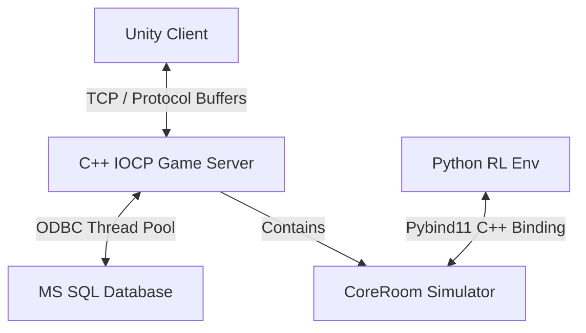

# Project A: Project TOY 

C++ IOCP 멀티스레드 서버, Unity 3D 게임 클라이언트, 그리고 Python Gymnasium 강화학습 환경이 융합된 실시간 멀티플레이어 ONLINE 게임 & AI 시뮬레이터 프로젝트입니다.


## 영상(video)

실시간 서버 클라이언트 테스트 영상:
https://www.youtube.com/watch?v=E2u_TFyD2zw


python 시뮬레이션 학습 및 추론 테스트 영상 :
https://www.youtube.com/watch?v=q9-bs3Hth-8
---

## 전체 시스템 아키텍처

본 프로젝트는 실시간 게임 플레이를 위한 고성능 네트워크 레이어와 강화학습 학습을 위한 물리 레이어가 격리된 구조로 설계되었습니다.



### 1. C++ Game Server (`Project_TOY_server`)
* **네트워크 코어:** IOCP(Input/Output Completion Port) 기반의 멀티스레드 네트워크 엔진 탑재.


* **아키텍처 분리:** 실시간 소켓 통신 및 세션을 관리하는 `Room` 레이어와, 순수 게임 물리 및 충돌 연산을 처리하는 `CoreRoom` 레이어로 분리 설계.
* **데이터베이스:** ODBC 연결 풀링(Connection Pooling) 기법 기반의 `DBManager` 스레드 풀을 활용한 비동기 DB 처리.
* **RL 모델 추론:** ONNX Runtime C++ API를 탑재하여 실시간 서비스 환경에서 강화학습 모델 추론 기능 통합.


### 2. Unity Client (`Project_TOY_client_c_sharp_unity`)
* **3D 시각화:** Unity 엔진 기반 캐릭터 이동, 회전, 스킬 연출 구현.
* **동기화 보정:** 서버 위주 판정을 유지하되 클라이언트 단에서 Lerp를 통한 부드러운 위치 보간(Interpolation) 연출.
* **네트워크 동기화:** C++ 서버와 Protocol Buffers 패킷을 공유하여 패킷 지연 최소화.

### 3. Python RL Simulator (`Project_TOY_RL`)
* **Pybind11 엔진 바인딩:** C++ `CoreRoom` 로직을 그대로 컴파일한 `game_core.pyd` 모듈을 임포트하여 고속 C++ 시뮬레이션 구동.
* **가상 시간(Virtual Time) 제어:** 시뮬레이션 환경에서는 학습시간 단축을 위해 실제 시간대신 가상시간 사용.
* **Gymnasium 라이브러리:** Gymnasium 표준 인터페이스인 `ToyMonsterEnv` 환경을 제공하여 Stable-Baselines3, Ray RLlib 등의 범용 학습 라이브러리와 호환.

---


### 게임서버 <-> Python RL 시뮬레이터 데이터 파이프 라인

* 실시간 추론 (게임 서버 -> onnx(추론)->게임 서버)
Project_TOY_sever (게임 서버) 프로젝트 폴더에 보면 Monster.h , Monster.cpp 파일로 정의된 Monster class가 있음. 이 클래스의 내부 함수로 써 GatherContext()를 호출함. 이 함수는  std::vecotr<float> 형태의 벡터로 그 시점의 observation space의 정보를 반환하고 미리 준비 되어 있는 onnx 형태의 RL model를 활용해 예측을 진행함. 코드상에서는 구체적으로 이 역할을 RLModelManager 클래스가 담당하고 있음

* 학습 (python env.py -> pyd(게임 로직))-> onnx모델 생성->게임 서버로 복사
네트워크 로직이 제거된 게임의 판정만 담당하는 CoreRoom 클래스와 오브젝트 클래스들 (GameObject.cpp, Creature.cpp,Player.cpp,Monster.cpp,Projectile.cpp) 그리고 맵 관련 클래스들 (Map.cpp,MapManager.cpp) 을 pyd 파일로 빌드하여 python 환경에서 호출할 수 있게 준비한 뒤 python 환경에서 Gymnasium 라이브러리 등을 활용해 가상 시뮬레이션 환경을 구축함.
여기서는 위에서 언급했듯 가상 시간을 사용함. 이 과정을 통해 생산된 모델을 onnx 파일로 변환 하고 c++서버 프로젝트로 복사함.

* 유의점

GatherContext() 가 반환하는 std::vecotr<float>의 size가 결국 벡터의 dimesnon 을 의미하고 이것이 RL model즉 onnx 파일에서 요구하는 diemson과 일치해야함. 또한 GatherContext() 함수에서 std::vecotr<float> 구성할때 각 인자의 순서가 observation space의 각 칼럼의 인덱스를 의미 함으로 순서가 뒤바뀌어선 안됨. 이 순서가 뒤바뀌는 것을 방지하기위해 python 시뮬레이션 환경에서도 (Project_TOY_RL/env.py) 같은 함수인 GatherContext() 을 호출해서 observation space를 가져오고 있음.

또한 action space 역시 Monster::ExecuteHighLevelAction 에서 입력 파라미터로 받고 있는 actionId 의 집합이기 때문에 여기서 분기하는 switch-case 문의 갯수와 action space의 dimenson이 일치 해야함.


## 사용한 빌드 및 환경 설정 방법

### 1. C++ -> Python Module (.pyd) 컴파일 방법
파이썬 학습 환경에서 사용되는 물리 시뮬레이터를 빌드하기 위해 아래 명령어를 수행합니다. (Visual Studio 2022 및 vcpkg 설정 필요)

```powershell
# Project_TOY_server 디렉토리 기준
cmake -B build -S . -DCMAKE_BUILD_TYPE=Release -DCMAKE_TOOLCHAIN_FILE="[VCPKG_PATH]/scripts/buildsystems/vcpkg.cmake"
cmake --build build --config Release
```
* 빌드 완료 후 생성된 `game_core.pyd` 파일을 `Project_TOY_RL` 폴더로 복사해야 학습이 가능합니다.

### 2. 강화학습 환경 실행 방법
```bash
# Project_TOY_RL 디렉토리 기준
pip install -r requirements.txt
python train.py
```


