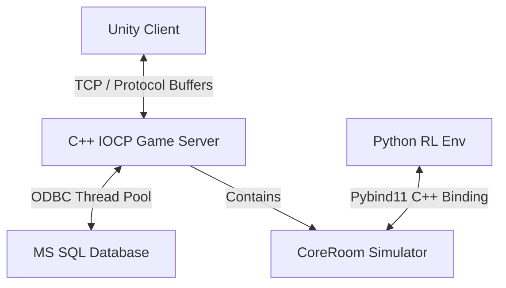

# Project A: Project TOY 

C++ IOCP 멀티스레드 서버, Unity 3D 게임 클라이언트, 그리고 Python Gymnasium 강화학습 환경이 융합된 실시간 멀티플레이어 ONLINE 게임 & AI 시뮬레이터 프로젝트입니다.

---

## 전체 시스템 아키텍처

본 프로젝트는 실시간 게임 플레이를 위한 고성능 네트워크 레이어와 강화학습 학습을 위한 물리 레이어가 격리된 구조로 설계되었습니다.



### 1. C++ Game Server (`Project_TOY_server`)
* **네트워크 코어:** IOCP(Input/Output Completion Port) 기반의 멀티스레드 네트워크 엔진 탑재.
* **아키텍처 분리:** 실시간 소켓 통신 및 세션을 관리하는 `Room` 레이어와, 순수 게임 물리 및 충돌 연산을 처리하는 `CoreRoom` 레이어로 분리 설계.
* **데이터베이스:** ODBC 연결 풀링(Connection Pooling) 기법 기반의 `DBManager` 스레드 풀을 활용한 비동기 DB 처리.
* **RL 모델 추론:** ONNX Runtime C++ API를 탑재하여 실시간 서비스 환경에서 강화학습 모델 추론 기능 통합.

### 2. Unity Client (`Project_TOY_client_c_sharp_unity`)
* **3D 시각화:** Unity 엔진 기반 캐릭터 이동, 회전, 스킬 연출 구현.
* **동기화 보정:** 서버 위주 판정을 유지하되 클라이언트 단에서 Lerp를 통한 부드러운 위치 보간(Interpolation) 연출.
* **네트워크 동기화:** C++ 서버와 Protocol Buffers 패킷을 공유하여 패킷 지연 최소화.

### 3. Python RL Simulator (`Project_TOY_RL`)
* **Pybind11 엔진 바인딩:** C++ `CoreRoom` 로직을 그대로 컴파일한 `game_core.pyd` 모듈을 임포트하여 고속 C++ 시뮬레이션 구동.
* **가상 시간(Virtual Time) 제어:** 시뮬레이션 환경에서는 학습시간 단축을 위해 실제 시간대신 가상시간 사용.
* **Gymnasium 규격:** Gymnasium 표준 인터페이스인 `ToyMonsterEnv` 환경을 제공하여 Stable-Baselines3, Ray RLlib 등의 범용 학습 라이브러리와 호환.

---

## 사용한 빌드 및 환경 설정 방법

### 1. C++ -> Python Module (.pyd) 컴파일 방법
파이썬 학습 환경에서 사용되는 물리 시뮬레이터를 빌드하기 위해 아래 명령어를 수행합니다. (Visual Studio 2022 및 vcpkg 설정 필요)

```powershell
# Project_TOY_server 디렉토리 기준
cmake -B build -S . -DCMAKE_BUILD_TYPE=Release -DCMAKE_TOOLCHAIN_FILE="[VCPKG_PATH]/scripts/buildsystems/vcpkg.cmake"
cmake --build build --config Release
```
* 빌드 완료 후 생성된 `game_core.pyd` 파일을 `Project_TOY_RL` 폴더로 복사해야 학습이 가능합니다.

### 2. 강화학습 환경 실행 방법
```bash
# Project_TOY_RL 디렉토리 기준
pip install -r requirements.txt
python train.py
```

---

